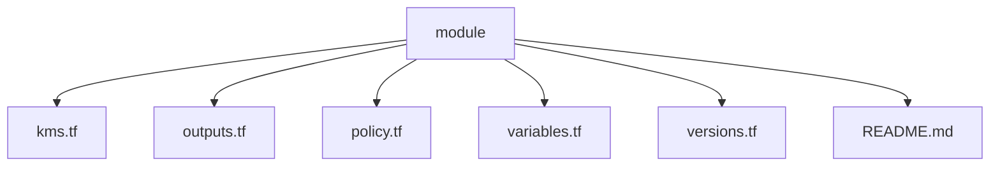
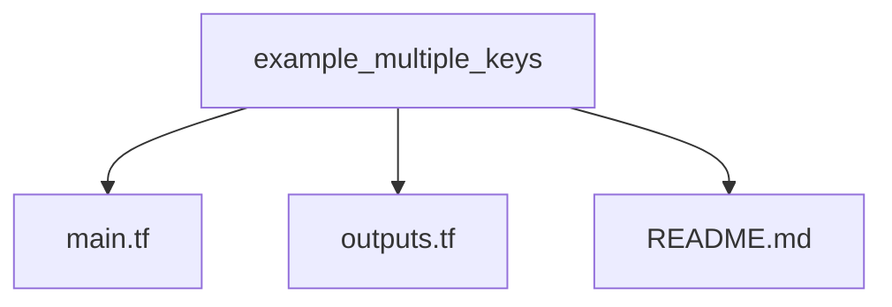

## Introduction 

This repository hosts Terraform code for creating production grade AWS KMS keys. 

The code has been written such that it's scalable and is able to create multiple keys with different configurations as needed. The code does the following: 

1. Creates multiple AWS KMS keys in an AWS account. 
2. Creates both `Symmetric` and `Asymmetric` keys with different encryption algorithms for the `asymmetric` keys. 
3. Creates AWS KMS key alias for each key.
4. Creates key policy to grant access as required.

## Repository structure 

This repository contains terraform module that can be re-used as needed and an example usage of the module. Two folders of key importance are as follows:

1. modules - Houses terraform module for creating multiple AWS KMS keys.

2.  example_multiple_keys - An example demonstrating the use of terraform module to create multiple AWS KMS keys. 
 

